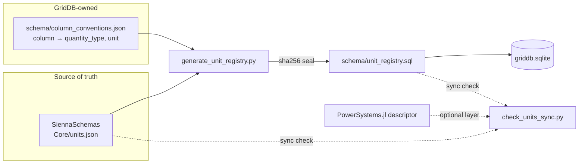
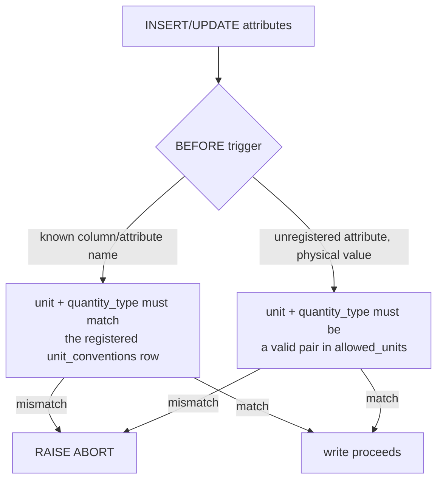

# Units in SiennaGridDB

How SiennaGridDB declares, generates, and enforces physical units — for `time-series-store` to
mirror the pattern, and to match the schema when a time series ends up stored inside GridDB itself.

## 1. Vocabulary and generation

One shared vocabulary, generated into a sealed SQL file, loaded like any other schema file.



`generate_unit_registry.py` refuses any `(quantity_type, unit)` pair absent from `units.json` — the
registry can never invent vocabulary. Regeneration is deterministic: same inputs, byte-identical
output, same seal.

## 2. Schema

Five tables carry the vocabulary and the column map; two more attach units to data rather than to
a fixed schema column.

```mermaid
erDiagram
    quantity_types ||--o{ allowed_units : constrains
    quantity_types ||--o{ unit_conventions : "typed by"
    quantity_types ||--o{ unit_basis_rules : "typed by"
    quantity_types ||--o{ attributes : "typed by"
    allowed_units ||--o{ attributes : validates
    unit_basis_rules }o..o{ unit_conventions : "quantity_type match, not FK"
    entities ||--o{ attributes : has

    quantity_types {
        text name PK
        text default_unit
        text dimension
        text description
    }
    allowed_units {
        text quantity_type FK
        text unit
    }
    unit_conventions {
        int id PK
        text table_name
        text column_name
        text quantity_type FK
        text unit
        text discriminator_column
        text discriminator_value
        text base_power_ref
        text base_voltage_ref
    }
    unit_basis_rules {
        text quantity_type PK_FK
        text base_expression
        text description
    }
    attributes {
        int id PK
        int entity_id FK
        text name
        json value
        text unit
        text quantity_type FK
    }
```

Two ways a column gets its unit:

- **Fixed schema column** (`transmission_lines.continuous_rating`) — one `unit_conventions` row,
  joined for display through the `column_units` view.
- **Polymorphic column** (`transformer_circuits.r`, whose unit depends on `unit_basis`) — one
  `unit_conventions` row per discriminator value. `attributes` rows follow the same idea but carry
  their own `unit`/`quantity_type` inline, because the sibling discriminator doesn't exist in the
  generic attribute table.

Time series don't use either — see §4. `unit_basis` and the pu resolution mechanism are §5.

## 3. Enforcement

The registry tables are read-only after the seal row is inserted; `attributes` and
`time_series_associations` writes are checked against the vocabulary by triggers, not by
application code.



Registry writes themselves (`quantity_types`, `allowed_units`, `unit_conventions`) are blocked
outright once `unit_management_metadata.unit_conventions_checksum` exists — the only way to change
the vocabulary is regenerate-and-reload. The seal is **detection, not prevention**: SQLite has no
privilege model, so `verify_unit_registry.py` is what actually catches tampering.

## 5. Basis: per-unit vs. natural units, and where the base number lives

A pu value is meaningless without knowing what it's normalized against. GridDB expresses that with
two orthogonal axes, not one: **basis** (is this pu or a physical unit?) and **quantity** (which
physical quantity, and — under `NATURAL_UNITS` — which representation of it?).

### Axis 1: `unit_basis`, exactly two values

One discriminator column, `unit_basis`, on nine tables — `transmission_lines`,
`transformer_circuits`, `three_winding_transformers`, `fixed_admittance`, `switched_admittance`,
`sources`, `tmodel_hvdc_lines`, `facts_control_devices`, `interconnecting_converters` (time series
carry the same two-valued
choice as `time_series_associations.unit_system`, in infrastore's lowercase spelling — see §6):

- **`NATURAL_UNITS`** — a physical unit (ohm, S, MVAr, MW, kV). Self-contained, no base needed.
- **`COMPONENT_BASE`** — dimensionless pu against bases reachable from the row.

### Why two basis values

Upstream's `UnitSystem` enum is exactly `COMPONENT_BASE` / `NATURAL_UNITS`, and `unit_basis`
matches it 1:1. `COMPONENT_BASE` means *pu against the base recorded on the component*: by
design the base is a per-component property — a transformer circuit's own `base_power`, a
line's `base_power` snapshotting the system base — so no system-level table has to exist.
Which number the component's base happens to record (its own winding base, the system base)
is the component's business; the label only says *where to find the number*, and the pu value
is interpreted the same way once it's found.

### Axis 2: `quantity_type` also selects the natural-unit representation

Under `NATURAL_UNITS`, `quantity_type` picks *which* physical representation a column holds. This is
how the old `admittance_units` value `COMPONENT_MVAR` was absorbed without a third basis value:
`fixed_admittance.y_b` (and `switched_admittance.y_b`) each carry three `unit_conventions` rows —

| quantity_type | unit | unit_basis |
|---|---|---|
| `Susceptance` | `S` | `NATURAL_UNITS` |
| `ReactivePower` | `MVAr` | `NATURAL_UNITS` |
| `Susceptance` | `pu` | `COMPONENT_BASE` |

— the electrical form and the PSS/E form (MVAr at 1.0 pu voltage) are both natural units,
distinguished only by `quantity_type`. This required widening `unit_conventions`' uniqueness key
from `(table_name, column_name, discriminator_value, discriminator_value_2)` to also include
`quantity_type`.

### PSSE grounding: why transformers are the exception

Verified in `PowerFlowFileParser.jl`, `src/pm_io/psse.jl` (~line 276): a transformer winding record
carries its own base (`SBASE1-2`/`2-3`/`3-1`, `NOMV1`/`2`/`3`, with `CZ` selecting the convention),
so `three_winding_transformers.base_power_12`/`_23`/`_31` store that base verbatim. A BRANCH record
declares no MVA base of its own — `SBASE`, the system base, is the only base available — and a fixed
or switched shunt's `GL`/`BL` are MW/MVAr at unity voltage, so both take the system base written in
at parse time instead. That's why `transmission_lines`, `fixed_admittance`, and `switched_admittance`
carry a `base_power` column that is a *snapshot* rather than a device-native quantity.

### There is still no system base stored in the database

No `systems`/`cases` table exists, and none was added. A single shared `base_power` row would be
mutable state that silently reinterprets every `COMPONENT_BASE` row the moment two callers assume
different values. "System base" remains a property of the model an application builds
(`PSY.get_base_power(sys)`), decided once at load time. What changed is that each row now *carries
or can reach* the number it was normalized against — not that GridDB now knows the system's one true
base.

**Accepted limitation.** Nothing enforces that every row's `base_power` agrees. A writer that
inserts one line at 100 MVA and another at 138 MVA produces two internally consistent rows that
contradict each other, silently. Cross-row agreement is an application responsibility; a future
trigger could enforce it but does not exist today.

**Accepted limitation.** The base columns a `COMPONENT_BASE` row resolves against —
`balancing_topologies.base_voltage`, `sources.base_voltage`,
`transformer_circuits.base_voltage_primary`/`base_voltage_secondary` — are nullable, and nothing
enforces that they are actually set. An ordinary insert of a `transmission_lines` row whose buses
have no `base_voltage` set succeeds: `unit_basis` defaults to `COMPONENT_BASE`, `base_power`
defaults to 100.0, and `r`/`x` are stored as pu — but the resolved `base_voltage` is NULL, and
since `Resistance`/`Reactance` resolve via `base_voltage^2/base_power`, that pu value cannot be
converted at all. This is strictly worse than the cross-row disagreement above: the value is
absent, not merely inconsistent. Closing it would require either per-table triggers asserting the
resolved base is non-null when `unit_basis = 'COMPONENT_BASE'`, or making
`balancing_topologies.base_voltage` `NOT NULL`; both are open decisions, not yet taken.

### Mechanical resolution: rules + base references

A sealed table, `unit_basis_rules` (5 rows), maps the five quantity types that ever carry pu to the
base expression that resolves them:

| quantity_type | base_expression |
|---|---|
| `Voltage` | `base_voltage` |
| `Resistance`, `Reactance` | `base_voltage^2/base_power` |
| `Susceptance`, `Conductance` | `base_power/base_voltage^2` |

`unit_conventions` gained nullable `base_power_ref` / `base_voltage_ref` naming *which* bases apply.
No arrow means a same-row column; an arrow is an FK hop, each segment after the first written
`table.column`, the last segment naming the base column itself:

```
base_power_ref   = 'base_power_12'                                            -- same row
base_power_ref   = 'circuit->transformer_circuits.base_power'                 -- one hop
base_voltage_ref = 'arc_id->arcs.from_id->balancing_topologies.base_voltage'  -- two hops
```

The rule: a base must be reachable **without leaving the database** — same-row and FK-path both
satisfy that; only "in the modeling application" doesn't. `balancing_topologies.base_voltage` is new
— bus base voltage previously lived only as an `attributes` row — and is the target of most
two-winding and line paths. `transmission_lines`, `fixed_admittance`, `switched_admittance`, and
`tmodel_hvdc_lines` also gained their own same-row `base_power`.

Together these give one invariant, checked by `test_pu_conventions_have_resolvable_basis`: every
`unit='pu'` convention has a `unit_basis_rules` row for its quantity type, and every base reference
it names resolves *structurally* — the named column exists, or every FK hop's table/column/FK
exists. That is a schema-shape guarantee, not a data guarantee: it says the base is reachable, not
that any given row's base is populated — see the second Accepted limitation above. Not every pu
column carries a `unit_basis` discriminator, though — the `magnetizing_shunt` halves on both
transformer tables are pu-only, with no `NATURAL_UNITS` sibling row.

`attributes` rows are exempt from base references: an attribute's owner is polymorphic (`entity_id`
→ `entities`), so no single static path applies regardless of which table is on the other end. They
keep their inline `unit`/`quantity_type` instead; the exemption is recorded in
`coverage_decisions.json`.

### Open items

- `transformer_circuits.controlled_quantity_limits` resolves its pu arms against
  `base_voltage_primary`, but the PSS/E VMA/VMI controlled bus may be the *secondary* side for some
  transformers. Flagged for human review, not resolved here.
- No cross-repo check catches a pu column typed with the wrong quantity dimension (e.g. a
  `Resistance` column mistakenly registered as `Voltage`, still `unit='pu'`) — upstream x-unit
  annotations carry units, not quantity types, so there's nothing on the other side to contradict.
  `test_pu_conventions_have_resolvable_basis` only exercises columns with a `COMPONENT_BASE` +
  `NATURAL_UNITS` sibling pair; pu-only columns with no such sibling arm (the
  `magnetizing_shunt` rows above) are not covered by any dimensional check.
