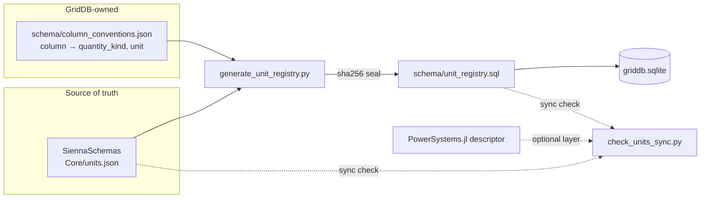
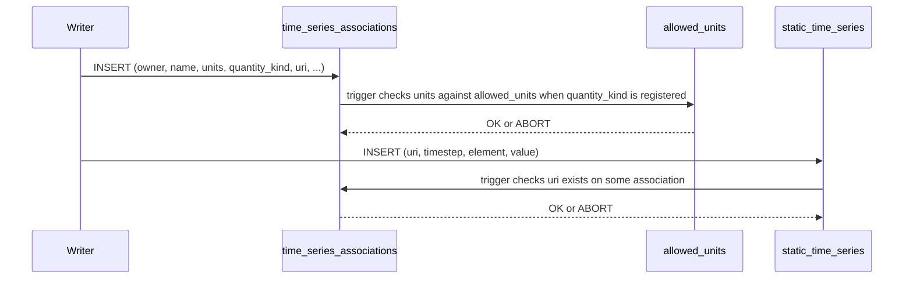

# Units in SiennaGridDB

How SiennaGridDB declares, generates, and enforces physical units — for `time-series-store` to
mirror the pattern, and to match the schema when a time series ends up stored inside GridDB itself.

## 1. Vocabulary and generation

One shared vocabulary, generated into a sealed SQL file, loaded like any other schema file.


```mermaid
flowchart LR
    subgraph Source of truth
        U[SiennaSchemas<br/>Core/units.json]
    end
    subgraph GridDB-owned
        C[schema/column_conventions.json<br/>column → quantity_kind, unit]
    end
    U --> G[generate_unit_registry.py]
    C --> G
    G -->|sha256 seal| R[schema/unit_registry.sql]
    R --> DB[(griddb.sqlite)]
    U -.sync check.-> S[check_units_sync.py]
    R -.sync check.-> S
    PSY[PowerSystems.jl descriptor] -.optional layer.-> S
```

`generate_unit_registry.py` refuses any `(quantity_kind, unit)` pair absent from `units.json` — the
registry can never invent vocabulary. Regeneration is deterministic: same inputs, byte-identical
output, same seal.

## 2. Schema

Five tables carry the vocabulary and the column map; two more attach units to data rather than to
a fixed schema column.

```mermaid
erDiagram
    quantity_kinds ||--o{ allowed_units : constrains
    quantity_kinds ||--o{ unit_conventions : "typed by"
    quantity_kinds ||--o{ unit_basis_rules : "typed by"
    quantity_kinds ||--o{ attributes : "typed by"
    quantity_kinds }o..o{ time_series_associations : "guarded when name is registered"
    allowed_units ||--o{ attributes : validates
    allowed_units }o..o{ time_series_associations : "validates registered kinds"
    unit_basis_rules }o..o{ unit_conventions : "quantity_kind match, not FK"
    entities ||--o{ attributes : has
    time_series_associations ||--o{ static_time_series : "values for (by uri)"
    entities ||--o{ time_series_associations : owns

    quantity_kinds {
        text name PK
        text default_unit
        text dimension
        text description
    }
    allowed_units {
        text quantity_kind FK
        text unit
    }
    unit_conventions {
        int id PK
        text table_name
        text column_name
        text quantity_kind FK
        text unit
        text discriminator_column
        text discriminator_value
        text base_power_ref
        text base_voltage_ref
    }
    unit_basis_rules {
        text quantity_kind PK_FK
        text base_expression
        text description
    }
    attributes {
        int id PK
        int entity_id FK
        text name
        json value
        text unit
        text quantity_kind FK
    }
    time_series_associations {
        int id PK
        int owner_id FK
        text owner_category
        text time_series_type
        text name
        int scenario_count
        text units
        text quantity_kind
        text unit_system
        text uri
        text data_hash
        text features_hash
    }
    static_time_series {
        text uri
        int timestep
        int element
        real value
    }
```

Two ways a column gets its unit:

- **Fixed schema column** (`transmission_lines.continuous_rating`) — one `unit_conventions` row,
  joined for display through the `column_units` view.
- **Polymorphic column** (`transformer_circuits.r`, whose unit depends on `parameter_units`) — one
  `unit_conventions` row per discriminator value. `attributes` rows follow the same idea but carry
  their own `unit`/`quantity_kind` inline, because the sibling discriminator doesn't exist in the
  generic attribute table.

Time series don't use either — see §4. `parameter_units` and the pu resolution mechanism are §5.

## 3. Enforcement

The registry tables are read-only after the seal row is inserted; `attributes` and
`time_series_associations` writes are checked against the vocabulary by triggers, not by
application code.

```mermaid
flowchart TD
    W[INSERT/UPDATE attributes or time_series_associations] --> T{BEFORE trigger}
    T -->|known column/attribute name| M[unit + quantity_kind must match\nthe registered unit_conventions row]
    T -->|unregistered attribute, physical value| A[unit + quantity_kind must be\na valid pair in allowed_units]
    T -->|association with REGISTERED quantity_kind| V[units must match a registered\n(quantity_kind, unit) pair in allowed_units]
    T -->|association with free-form quantity_kind| OK
    M -->|mismatch| X[RAISE ABORT]
    A -->|mismatch| X
    V -->|mismatch| X
    M -->|match| OK[write proceeds]
    A -->|match| OK
    V -->|match| OK
```

Registry writes themselves (`quantity_kinds`, `allowed_units`, `unit_conventions`) are blocked
outright once `unit_management_metadata.unit_conventions_checksum` exists — the only way to change
the vocabulary is regenerate-and-reload. The seal is **detection, not prevention**: SQLite has no
privilege model, so `verify_unit_registry.py` is what actually catches tampering.

## 4. Time series: unit-per-association, not unit-per-column

A time series column can't have one fixed unit — the same `static_time_series` table holds load,
wind, price, and reserve data. So the unit lives on the association row, exactly where infrastore's
catalog puts it (`units`, `quantity_kind`, `unit_system`):


```mermaid
sequenceDiagram
    participant App as Writer
    participant Assoc as time_series_associations
    participant Reg as allowed_units
    participant Data as static_time_series

    App->>Assoc: INSERT (owner, name, units, quantity_kind, uri, ...)
    Assoc->>Reg: trigger checks units against allowed_units when quantity_kind is registered
    Reg-->>Assoc: OK or ABORT
    App->>Data: INSERT (uri, timestep, element, value)
    Data->>Assoc: trigger checks uri exists on some association
    Assoc-->>Data: OK or ABORT
```

Alongside those, `id` — the table's `INTEGER PRIMARY KEY AUTOINCREMENT` — carries the store-minted
id, mirroring infrastore's own declaration verbatim. It is not decoration: a time-series-backed
cost payload names its series by this number, spelled `association_id` on the wire — a
`TIME_SERIES_*` function data's `association_id`, `FuelCurve.fuel_cost_time_series`,
`MarketBidTimeSeriesCost.start_up_association_id`, and the two `*_association_id` fields on the
incremental and average-rate curves. `association_id` is not a second column, only this one's wire
spelling. `AUTOINCREMENT` is what makes it safe to carry: SQLite never reissues an id a delete
freed, so a stored reference either still resolves to the same row or fails outright — never
silently landing on a different series that later reused the same number. The id is meaningful
only against its origin store; aggregating rows from more than one store means re-minting ids on
import, exactly as infrastore's own `merge` does.

`quantity_kind` is deliberately free-form, mirroring infrastore: composite economic quantities
($/MWh, MMBtu/MWh) must not require a vocabulary migration. The guard fires only when a row uses a
REGISTERED quantity-type name with an unregistered (or missing) unit — a typo on a known quantity
is a defect, not new vocabulary. Dense values are located by `uri` (the SiennaSchemas wire form's
required locator; here it keys `static_time_series` directly): inserts are rejected until some
association declares the `uri`, so associations load first and arrays shared by many associations
are stored once. The association's optional `data_hash` is an integrity hash of the array, not the
key.

**Value layout: the stored array's geometry.**
Each stored value is one row `(uri, timestep, element, value)`, and every slot of the stored array is kept exactly as infrastore holds it.
The split comes from the stored array alone, never from an association: infrastore's content hash covers an array's bytes, dtype and shape but not its `element_type`, so one `uri` can serve associations that read it differently, and they must all find one layout.
`element` is the 0-based index on the stored array's last axis, 0 for a one-axis array, and `timestep` is the 0-based row-major index over every axis before it.
For a static series those are the time step and the slot within a composite element.
A forecast follows the geometry `array_shape` records: infrastore stores a `Deterministic` as `[horizon_steps, count, *element_shape]`, and a `Probabilistic` or `Scenarios` forecast puts its percentile or scenario axis in front of that.
So a scalar `Deterministic` stores window `w` at horizon step `h` as `(timestep h, element w)`, and a composite one stores slot `e` of that window and step as `(h * count + w, e)`.
Composite elements (`tuple(N,dtype)` and the function-data kinds) keep every raw slot, including a piecewise row's leading used-count slot; decoding them is the consumer's job, per `element_type`.
A NaN is stored as a NULL `value`, because SQLite has no NaN and binds one as NULL; infinities stay REAL.
The layout reads neither `element_type` nor `element_shape`, so a `DeterministicSingleTimeSeries` row carrying `element_shape` `[]` for a composite source changes nothing; every association that declares an `array_shape` must declare the stored one, and the inserters check that against the sidecar, even for an array the database already holds.

**Timestamps: the `time_series_values` view.**
No row stores a timestamp: step `k` of a series is `initial_timestamp + k * resolution`, computed in UTC exactly as infrastore's `Period::add_to` does, so there is no DST gap or repeat.
Three generated columns on `time_series_associations` hold that arithmetic, parsed once per association when the row is written: `t0_ms` (`initial_timestamp` in Unix milliseconds), and either `step_ms` for a fixed resolution (`PT1H`, `P1D`, `PT0.25S`, `P1DT1H30M0.5S`) or `step_months` for a calendar one (`P1M`, `P1Y`, `P1Y6M`).
A fixed step is `t0_ms + k * step_ms`.
A calendar step adds `k * step_months` months to the start month and keeps the initial day, clamped to the target month's last day, as chrono's `checked_add_months` does: from Jan 31 a monthly series reads Jan 31, Feb 29, Mar 31, Apr 30.
They are GridDB's own columns, outside the infrastore mirror, and `PRAGMA table_info` hides them.
`time_series_values` joins every `SingleTimeSeries` association to its stored values and spells each timestamp `YYYY-MM-DDTHH:MM:SS.sssZ` (UTC, millisecond precision, the same width on every row, so text order is time order).
Its columns are `association_id`, `owner_id`, `owner_type`, `owner_category`, `name`, `time_series_type`, `timestamp`, `timestep`, `element`, `value` and `units`.
It uses only SQLite built-ins available since 3.38, so older readers such as DuckDB's SQLite scanner (SQLite 3.38.1) read it too.
The timestamp is computed per row, so a filter on it scans the association's values, while a filter on `timestep` uses the `(uri, timestep, element)` index:

```sql
-- One series, 06:00 to 17:00 UTC, by timestamp
SELECT timestamp, element, value FROM time_series_values
WHERE association_id = 7300
  AND timestamp BETWEEN '2026-07-22T06:00:00.000Z' AND '2026-07-22T17:00:00.000Z';

-- The same window by timestep: initial_timestamp is 00:00 and the resolution PT1H
SELECT timestamp, element, value FROM time_series_values
WHERE association_id = 7300 AND timestep BETWEEN 6 AND 17;
```

A zoneless series (`time_reference` `zoneless`) is read the same way, so its `Z` names the wall clock it was written in, not an instant.
Forecasts are not in the view: a forecast value has an issue time (its window's start) as well as a target time, and `DeterministicSingleTimeSeries` windows overlap, so one stored value would be several rows.
Only the view's join to `static_time_series` depends on the value layout; storing values another way changes that source and nothing else.

**Arrays are shared, and cleaned up with their last association.**
The inserters store an array's values only the first time its `uri` appears in the database.
Deleting an association, directly or through its owner's cascade, deletes the `uri`'s values only when no remaining association names it (`delete_orphan_static_time_series`, and its twin for a `uri` update).
Two writes bypass that cleanup: an `INSERT OR REPLACE` conflict delete fires no trigger (`recursive_triggers` is off), and a one-statement `uri` swap across rows drops the array the second row then names.
The `orphaned_time_series` view lists what either leaves behind: values no association names, and associations whose `uri` has no values.
`feature_sets` rows are shared the same way and are never deleted.

**Every reference must resolve.**
The `dangling_time_series_references` view walks every payload column that can carry a time series reference (`association_id`, `*_association_id`, `FuelCurve.fuel_cost_time_series`) and lists the ids no `time_series_associations` row resolves; a bare integer payload is matched by its column or attribute name.
It is empty after a complete insert; `test_dangling_view_covers_every_reference_column` walks the SiennaSchemas components so a new reference-bearing column cannot be missed.

## 5. Basis: per-unit vs. natural units, and where the base number lives

A pu value is meaningless without knowing what it's normalized against. GridDB expresses that with
two orthogonal axes, not one: **basis** (is this pu or a physical unit?) and **quantity** (which
physical quantity, and — under `NATURAL_UNITS` — which representation of it?).

### Axis 1: `parameter_units`, exactly two values

One discriminator column, `parameter_units`, on seven tables — `transmission_lines`,
`transformer_circuits`, `three_winding_transformers`, `sources`, `tmodel_hvdc_lines`,
`facts_control_devices`, `interconnecting_converters`. The two shunt tables are not among them:
`fixed_admittance` and `switched_admittance` carry `admittance_units`, whose arms are
`NATURAL_UNITS` and `COMPONENT_MVAR`, because a shunt has no MVA rating to per-unitize against.
(Time series carry the same two-valued choice as `time_series_associations.unit_system`, in
infrastore's lowercase spelling — see §6):

- **`NATURAL_UNITS`** — a physical unit (ohm, S, MVAr, MW, kV). Self-contained, no base needed.
- **`COMPONENT_BASE`** — dimensionless pu against bases reachable from the row.

### Why two basis values

Upstream's `UnitSystem` enum is exactly `COMPONENT_BASE` / `NATURAL_UNITS`, and `unit_basis`
matches it 1:1. `COMPONENT_BASE` means *pu against the base recorded on the component*: by
design the base is a per-component property — a transformer circuit's own `base_power`, a
line's `base_power` snapshotting the system base — so no system-level table has to exist.
Which number the component's base happens to record (its own winding base, the system base)
is the component's business; the label only says *where to find the number*, and the pu value
is interpreted the same way once it's found.

### Axis 2: `quantity_kind` also selects the natural-unit representation

Under `NATURAL_UNITS`, `quantity_kind` picks *which* physical representation a column holds. This is
how the old `admittance_units` value `COMPONENT_MVAR` was absorbed without a third basis value:
`fixed_admittance.y_b` (and `switched_admittance.y_b`) each carry three `unit_conventions` rows —

| quantity_kind | unit | parameter_units |
|---|---|---|
| `Susceptance` | `S` | `NATURAL_UNITS` |
| `ReactivePower` | `MVAr` | `NATURAL_UNITS` |
| `Susceptance` | `pu` | `COMPONENT_BASE` |

— the electrical form and the PSS/E form (MVAr at 1.0 pu voltage) are both natural units,
distinguished only by `quantity_kind`. This required widening `unit_conventions`' uniqueness key
from `(table_name, column_name, discriminator_value, discriminator_value_2)` to also include
`quantity_kind`.

### PSSE grounding: why transformers are the exception

Verified in `PowerFlowFileParser.jl`, `src/pm_io/psse.jl` (~line 276): a transformer winding record
carries its own base (`SBASE1-2`/`2-3`/`3-1`, `NOMV1`/`2`/`3`, with `CZ` selecting the convention),
so `three_winding_transformers.base_power_12`/`_23`/`_31` store that base verbatim. A BRANCH record
declares no MVA base of its own — `SBASE`, the system base, is the only base available — and a fixed
or switched shunt's `GL`/`BL` are MW/MVAr at unity voltage, so both take the system base written in
at parse time instead. That's why `transmission_lines`, `fixed_admittance`, and `switched_admittance`
carry a `base_power` column that is a *snapshot* rather than a device-native quantity.

### There is still no system base stored in the database

No `systems`/`cases` table exists, and none was added. A single shared `base_power` row would be
mutable state that silently reinterprets every `COMPONENT_BASE` row the moment two callers assume
different values. "System base" remains a property of the model an application builds
(`PSY.get_base_power(sys)`), decided once at load time. What changed is that each row now *carries
or can reach* the number it was normalized against — not that GridDB now knows the system's one true
base.

**Accepted limitation.** Nothing enforces that every row's `base_power` agrees. A writer that
inserts one line at 100 MVA and another at 138 MVA produces two internally consistent rows that
contradict each other, silently. Cross-row agreement is an application responsibility; a future
trigger could enforce it but does not exist today.

**Accepted limitation.** The base columns a `COMPONENT_BASE` row resolves against —
`balancing_topologies.base_voltage`, `sources.base_voltage`,
`transformer_circuits.base_voltage_primary`/`base_voltage_secondary` — are nullable, and nothing
enforces that they are actually set. An ordinary insert of a `transmission_lines` row whose buses
have no `base_voltage` set succeeds: `parameter_units` defaults to `COMPONENT_BASE`, `base_power`
defaults to 100.0, and `r`/`x` are stored as pu — but the resolved `base_voltage` is NULL, and
since `Resistance`/`Reactance` resolve via `base_voltage^2/base_power`, that pu value cannot be
converted at all. This is strictly worse than the cross-row disagreement above: the value is
absent, not merely inconsistent. Closing it would require either per-table triggers asserting the
resolved base is non-null when `parameter_units = 'COMPONENT_BASE'`, or making
`balancing_topologies.base_voltage` `NOT NULL`; both are open decisions, not yet taken.

### Mechanical resolution: rules + base references

A sealed table, `unit_basis_rules` (5 rows), maps the five quantity kinds that ever carry pu to the
base expression that resolves them:

| quantity_kind | base_expression |
|---|---|
| `Voltage` | `base_voltage` |
| `Resistance`, `Reactance` | `base_voltage^2/base_power` |
| `Susceptance`, `Conductance` | `base_power/base_voltage^2` |

`unit_conventions` gained nullable `base_power_ref` / `base_voltage_ref` naming *which* bases apply.
No arrow means a same-row column; an arrow is an FK hop, each segment after the first written
`table.column`, the last segment naming the base column itself:

```
base_power_ref   = 'base_power_12'                                            -- same row
base_power_ref   = 'circuit->transformer_circuits.base_power'                 -- one hop
base_voltage_ref = 'arc_id->arcs.from_id->balancing_topologies.base_voltage'  -- two hops
```

The rule: a base must be reachable **without leaving the database** — same-row and FK-path both
satisfy that; only "in the modeling application" doesn't. `balancing_topologies.base_voltage` is new
— bus base voltage previously lived only as an `attributes` row — and is the target of most
two-winding and line paths. `transmission_lines`, `fixed_admittance`, `switched_admittance`, and
`tmodel_hvdc_lines` also gained their own same-row `base_power`.

Together these give one invariant, checked by `test_pu_conventions_have_resolvable_basis`: every
`unit='pu'` convention has a `unit_basis_rules` row for its quantity kind, and every base reference
it names resolves *structurally* — the named column exists, or every FK hop's table/column/FK
exists. That is a schema-shape guarantee, not a data guarantee: it says the base is reachable, not
that any given row's base is populated — see the second Accepted limitation above. Not every pu
column carries a `parameter_units` discriminator, though — the `magnetizing_shunt` halves on both
transformer tables are pu-only, with no `NATURAL_UNITS` sibling row.

`attributes` rows are exempt from base references: an attribute's owner is polymorphic (`entity_id`
→ `entities`), so no single static path applies regardless of which table is on the other end. They
keep their inline `unit`/`quantity_kind` instead; the exemption is recorded in
`coverage_decisions.json`.

### Open items

- `transformer_circuits.controlled_quantity_limits` resolves its pu arms against
  `base_voltage_primary`, but the PSS/E VMA/VMI controlled bus may be the *secondary* side for some
  transformers. Flagged for human review, not resolved here.
- No cross-repo check catches a pu column typed with the wrong quantity dimension (e.g. a
  `Resistance` column mistakenly registered as `Voltage`, still `unit='pu'`) — upstream x-unit
  annotations carry units, not quantity kinds, so there's nothing on the other side to contradict.
  `test_pu_conventions_have_resolvable_basis` only exercises columns with a `COMPONENT_BASE` +
  `NATURAL_UNITS` sibling pair; pu-only columns with no such sibling arm (the
  `magnetizing_shunt` rows above) are not covered by any dimensional check.

## 6. The infrastore mirror: association tables are a wire contract

GridDB's `time_series_associations` (with its `feature_sets` companion) and
`supplemental_attribute_associations` mirror infrastore's catalog tables column-for-column
(`crates/infrastore-core/src/metadata/schema.rs`), so association rows written here deserialize
straight into a store at the modeling stage. The mirror is the contract; consequences worth
knowing:

The generated step columns of `time_series_associations` (`t0_ms`, `step_ms`, `step_months`, §4) are GridDB's own, derived from the mirrored ones and hidden from `PRAGMA table_info`.

**`owner_category` and `time_series_type` hold the wire spelling, not infrastore's on-disk
codes.** Infrastore packs both as `INTEGER` (`::code`) for a measured index-size win at its own
scale; GridDB states its priority as user-friendly over performance (see the schema file header),
so both columns are `TEXT` holding the string spelling every reader and wire payload already uses
(`'Component'`/`'SupplementalAttribute'`; `'SingleTimeSeries'` through `'Scenarios'`) — no
decoding needed. `data_hash` / `features_hash` / `timestamps_hash` are lowercase hex TEXT (64
chars), matching infrastore's `hash_hex` spelling, not the raw 32-byte SHA-256 digest — directly
readable in a plain `sqlite3` shell, no decode view needed. A `NonSequentialTimeSeries`'s
explicit timestamp vector is not stored in this schema; `timestamps_hash` is only a locator into
the producing store, which holds the vector itself.

**Where the catalog and the SiennaSchemas wire form diverge, the wire form wins.** The schemas
(`TimeSeries/*.json`) require `uri` (the dense-data locator) and `element_shape`, and declare
`data_hash` an optional content hash; infrastore's catalog has no `uri` and requires `data_hash`.
GridDB follows the schemas: `uri` is NOT NULL and keys `static_time_series`, `element_shape` is
NOT NULL (default `'[]'` = scalar), `data_hash` is nullable. A row deserializing into a store that
demands a hash computes it from the dense values at ingest.

**`features_hash` follows infrastore's hashing contract.**
The inserters compute it as infrastore does (`crates/infrastore-core/src/hash.rs`): SHA-256 over `b"features\0"`, the map's length as `u64` little-endian, then for each key in UTF-8 byte order its length and bytes followed by a tagged value.
The tags are `i` with an `i64`, `f` with the `f64` bit pattern (any NaN as Rust's canonical `f64::NAN`), `b` with one byte, and `s` with a length-prefixed UTF-8 string.
A JSON integer is an Int and a number with a fraction or exponent is a Float, as Python and Julia parse them; TypeScript's `JSON.parse` cannot tell `1.0` from `1`, so it hashes a safe integer (`|x| < 2^53`) as an Int and every other number as a Float.
`test/features_hash_vectors.json` holds golden vectors that `test/test_features_hash_oracle.py` re-derives from infrastore itself; the empty map hashes to `f0f10eb0149a8828ad7505d73262e3e4a70bfdfed90e4c2e9ce6013758296ede`.
Each distinct map gets its `feature_sets` rows once (`ON CONFLICT (features_hash, key) DO NOTHING`, not `OR IGNORE`, which would also swallow the reserved-key CHECK).

**Two shape columns describe two different things.**
`element_shape` is the shape of *one timestep's* element - the trailing dims after the time axis, `'[]'` for scalar steps - and pairs with `element_type`, which says what that element means (`f64`, `tuple(N,dtype)`, a function-data kind).
`array_shape` is the *whole stored array's* native geometry, whose trailing axes end with `element_shape`: `[length, *element_shape]` for static types, and for forecasts the stored geometry §4's value layout follows.
It exists because a forecast's layout is a producer convention that cannot be reconstructed from `horizon`/`count`/`percentiles`/`scenario_count`; it is nullable (and wire-only for now - infrastore's catalog has no counterpart yet, same as `scenario_count`).

**`unit_system` uses infrastore's spelling, not the component tables'.**
Lowercase `'natural_units'` / `'component_base'`, NULL meaning unspecified, and deliberately no CHECK - a third basis must land without a format bump.
The wire's `UnitSystem` spells them uppercase; the insert manifest binds the value through `lower(?)`.
Same two-valued concept as §5's `unit_basis`, a different vocabulary on purpose: infrastore validates only these two spellings and passes the value through untouched - it is the producing application that decides which basis a series uses, and both infrastore and GridDB just relay its choice.

**`quantity_kind` is free-form; the registry guards only registered names.** Infrastore leaves the
column unconstrained so composite economic quantities never force a migration. GridDB adds one
write-side trigger on top: a row whose `quantity_kind` names a registered quantity kind must pair
it with a registered unit from `allowed_units`. Free-form kinds pass untouched; the divergence adds
integrity without changing the row shape.

**No per-series base snapshot.** A `component_base` series is interpreted against the owning
component's own base columns (`base_power`, winding voltage bases, …) — the association carries no
`base_power`/`base_voltage` of its own, matching infrastore, where the consumer's object model owns
the bases. Resolvability at the data level is the writer's responsibility, same as cross-row
`base_power` agreement in §5.

**GridDB keeps referential integrity infrastore deliberately omits.** Infrastore's endpoints live
in the consumer's object graph, so it has no FKs; here both endpoints live in this database, so
`owner_id`/`component_id`/`attribute_id` are FK-enforced (plus an owner-domain trigger for
`owner_category = 'SupplementalAttribute'`). FKs are GridDB-side only and vanish harmlessly on
deserialization.
